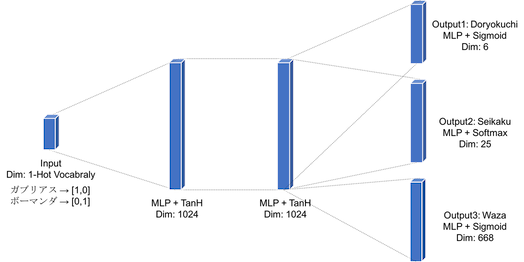

# PokemonOptimizer_chainer

This is Pokemon-Optimizer chainer implementation.

Description
https://qiita.com/nagayosi/items/12c3f9d1b4697d4e2ba6

This input is Pokemon name, and outputs Doryokuchi (6: HP, Atack, Defence, ... Speed), and Seikaku (1) and Waza (4).

Network is depicted in below figure.




## Requirements

```bash
Python3
Chainer
Numpy
```

## Result
```
ガブリアス
H |  A |  B |  C |  D |  S |
16| 212|   8|  24|  20| 228|
seikaku: ようき
waza1 : じしん
waza2 : げきりん
waza3 : がんせきふうじ
waza4 : つるぎのまい

ボーマンダ
H |  A |  B |  C |  D |  S |
60| 144|  52|  76|   8| 168|
seikaku: いじっぱり
waza1 : じしん
waza2 : げきりん
waza3 : りゅうせいぐん
waza4 : ストーンエッジ
```

## Training
When using GPU
```bash
python3 main.py --train --gpu
```

When using CPU
```bash
python main.py --train
```

## Test
When using GPU
```
python3 main.py --test --gpu
```
When using CPU
```
python main.py --test
```
